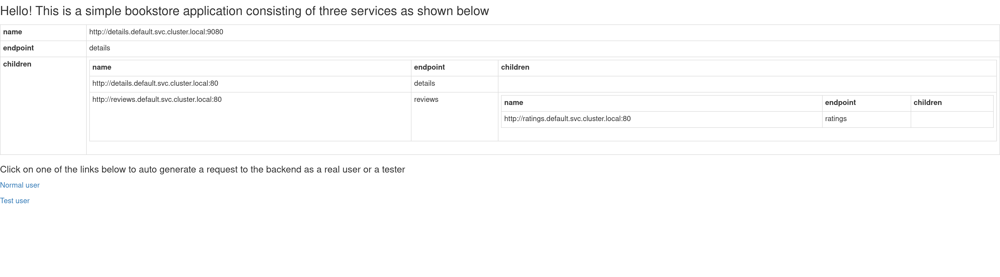
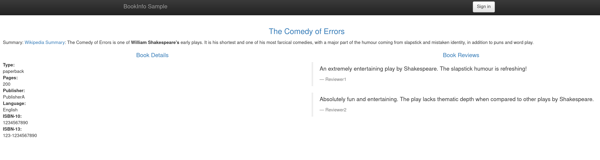
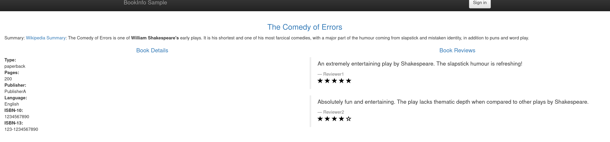
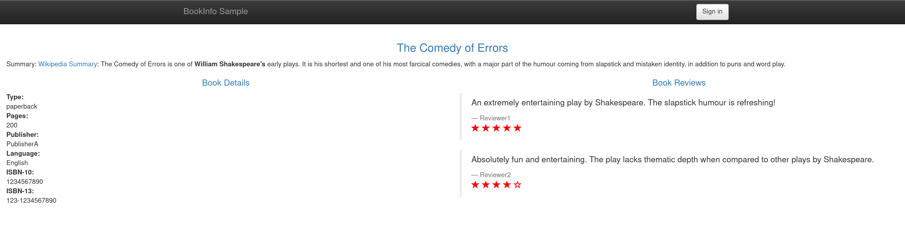

# Bookinfo on Knative

## Kind with Kourier & Knative:

Install Kind with Kourier and Knative.

```bash
$ curl -sL get.konk.dev | bash
$ kubectl get pods -n knative-serving
NAME                                      READY   STATUS    RESTARTS   AGE
3scale-kourier-control-5b464bcd66-2btdw   1/1     Running   0          22h
activator-8bf774c58-6st86                 1/1     Running   0          22h
autoscaler-59b86f8764-g4c74               1/1     Running   0          22h
controller-7c697c6857-lvwqv               1/1     Running   0          22h
webhook-6f4d97c469-qvn9d                  1/1     Running   0          22h
$ kubectl get pods -n knative-eventing
NAME                                    READY   STATUS    RESTARTS   AGE
eventing-controller-8548bbf497-86cjf    1/1     Running   0          22h
eventing-webhook-5fffb9c9cf-rvpdr       1/1     Running   0          22h
imc-controller-7fdd7465b-7fntq          1/1     Running   0          22h
imc-dispatcher-8b6999ccb-stml9          1/1     Running   0          22h
mt-broker-controller-86589c68c8-2pkh9   1/1     Running   0          22h
mt-broker-filter-77d9575645-52wdq       1/1     Running   0          22h
mt-broker-ingress-5c75444c66-slzxt      1/1     Running   0          22h

```

Install bookinfo sample app (emptyDir is not supported on Knative):

```bash
cat <<-EOF | kubectl apply -f -
---
apiVersion: v1
kind: ServiceAccount
metadata:
  name: bookinfo-details
  labels:
    account: details
---
apiVersion: serving.knative.dev/v1
kind: Service
metadata:
  name: details
  namespace: default
  labels:
    app: details
    version: v1
spec:
  template:
    metadata:
      annotations:
        autoscaling.knative.dev/minScale: "1"
    spec:
      serviceAccountName: bookinfo-details
      containers:
        - name: details
          image: docker.io/istio/examples-bookinfo-details-v1:1.16.2
          imagePullPolicy: Always
          ports:
            - containerPort: 9080
          securityContext:
            runAsUser: 1000
---
apiVersion: v1
kind: ServiceAccount
metadata:
  name: bookinfo-ratings
  labels:
    account: ratings
---
apiVersion: serving.knative.dev/v1
kind: Service
metadata:
  name: ratings
  namespace: default
  labels:
    app: ratings
    version: v1
spec:
  template:
    metadata:
      annotations:
        autoscaling.knative.dev/minScale: "1"
    spec:
      serviceAccountName: bookinfo-ratings
      containers:
        - name: ratings
          image: docker.io/istio/examples-bookinfo-ratings-v1:1.16.2
          imagePullPolicy: Always
          ports:
            - containerPort: 9080
          securityContext:
            runAsUser: 1000
---
apiVersion: v1
kind: ServiceAccount
metadata:
  name: bookinfo-reviews
  labels:
    account: reviews
---
apiVersion: serving.knative.dev/v1
kind: Service
metadata:
  name: reviews
  namespace: default
  labels:
    app: reviews
    version: v1
spec:
  template:
    metadata:
      annotations:
        autoscaling.knative.dev/minScale: "1"
    spec:
      serviceAccountName: bookinfo-reviews
      containers:
        - name: reviews
          image:  docker.io/skonto/examples-bookinfo-reviews-v1:test
          imagePullPolicy: Always
          env:
            - name: LOG_DIR
              value: "/tmp/logs"
            - name: SERVICES_DOMAIN
              value: "default.svc.cluster.local"  
            - name: SERVICES_PORT
              value: "80"    
            - name: ENABLE_RATING
              value: "TRUE"      
          ports:
            - containerPort: 9080
          securityContext:
            runAsUser: 1000

---
apiVersion: v1
kind: ServiceAccount
metadata:
  name: bookinfo-productpage
  labels:
    account: productpage
---
apiVersion: serving.knative.dev/v1
kind: Service
metadata:
  name: productpage
  namespace: default
  labels:
    app: productpage
    version: v1
spec:
  template:
    metadata:
      annotations:
        autoscaling.knative.dev/minScale: "1"
    spec:
      serviceAccountName: bookinfo-productpage
      containers:
        - name: productpage
          image:  docker.io/skonto/examples-bookinfo-productpage-v1:test
          imagePullPolicy: Always
          env:
            - name: LOG_DIR
              value: "/tmp/logs"
            - name: SERVICES_DOMAIN
              value: "default.svc.cluster.local"
            - name: SERVICES_PORT
              value: "80"  
          ports:
            - containerPort: 9080
          securityContext:
            runAsUser: 1000    
EOF
```

Test your setup:

```bash
$ kn revisions list
NAME                SERVICE       TRAFFIC   TAGS   GENERATION   AGE   CONDITIONS   READY   REASON
details-00001       details       100%             1            26s   4 OK / 4     True    
productpage-00001   productpage   100%             1            26s   4 OK / 4     True    
ratings-00001       ratings       100%             1            26s   4 OK / 4     True    
reviews-00001       reviews       100%             1            26s   4 OK / 4     True    

$ curl -s http://details.default.127.0.0.1.nip.io/details/0 | jq .
{
  "id": 0,
  "author": "William Shakespeare",
  "year": 1595,
  "type": "paperback",
  "pages": 200,
  "publisher": "PublisherA",
  "language": "English",
  "ISBN-10": "1234567890",
  "ISBN-13": "123-1234567890"
}

$ curl -s http://reviews.default.127.0.0.1.nip.io/reviews/0 | jq .
{
  "id": "0",
  "reviews": [
    {
      "reviewer": "Reviewer1",
      "text": "An extremely entertaining play by Shakespeare. The slapstick humour is refreshing!"
    },
    {
      "reviewer": "Reviewer2",
      "text": "Absolutely fun and entertaining. The play lacks thematic depth when compared to other plays by Shakespeare."
    }
  ]
}

$ curl -s http://ratings.default.127.0.0.1.nip.io/ratings/0 | jq .
{
  "id": 0,
  "ratings": {
    "Reviewer1": 5,
    "Reviewer2": 4
  }
}

```
Landing page is [http://productpage.default.127.0.0.1.nip.io](http://productpage.default.127.0.0.1.nip.io).


Check product page [http://productpage.default.127.0.0.1.nip.io/productpage?u=normal](http://productpage.default.127.0.0.1.nip.io/productpage?u=normal).



Split traffic:

```bash
$ kn service update reviews --tag=reviews-00001=v1
$ kn service update reviews --image  docker.io/skonto/examples-bookinfo-reviews-v2:test
$ kn service update reviews --tag=reviews-00002=v2
$ kn service update reviews --image  docker.io/skonto/examples-bookinfo-reviews-v3:test
$ kn service update reviews --tag=reviews-00003=v3
$ kn revision list
NAME                SERVICE       TRAFFIC   TAGS   GENERATION   AGE   CONDITIONS   READY   REASON
details-00001       details       100%             1            81s   4 OK / 4     True    
productpage-00001   productpage   100%             1            81s   4 OK / 4     True    
ratings-00001       ratings       100%             1            81s   4 OK / 4     True    
reviews-00003       reviews       100%      v3     3            20s   4 OK / 4     True    
reviews-00002       reviews                 v2     2            49s   4 OK / 4     True    
reviews-00001       reviews                 v1     1            81s   4 OK / 4     True    

$ kn service update  reviews --traffic v1=33,v2=33,v3=34
$ kn revision list
NAME                SERVICE       TRAFFIC   TAGS   GENERATION   AGE     CONDITIONS   READY   REASON
details-00001       details       100%             1            2m42s   4 OK / 4     True    
productpage-00001   productpage   100%             1            2m42s   4 OK / 4     True    
ratings-00001       ratings       100%             1            2m42s   4 OK / 4     True    
reviews-00003       reviews       34%       v3     3            101s    4 OK / 4     True    
reviews-00002       reviews       33%       v2     2            2m10s   4 OK / 4     True    
reviews-00001       reviews       33%       v1     1            2m42s   4 OK / 4     True    
```

Reload again the product page multi-times and you should hit a different review service (check asterisks color as well):




### Building custom images


```bash
$ git clone github.com/skonto/istio

$ git checkout knative

$ cd istio/samples/bookinfo/src

$ ./build-services.sh $TAG $DOCKER_REPO

# Manually push the created images
# docker push ${DOCKER_REPO}/examples-bookinfo-reviews-v1:$TAG
# ...
```
Note: the diff between the upstream Istio sample app and the branch used is to change the service port from 9080 to a custom one as Knative
assumes that to be 80 and cannot be adjusted.
